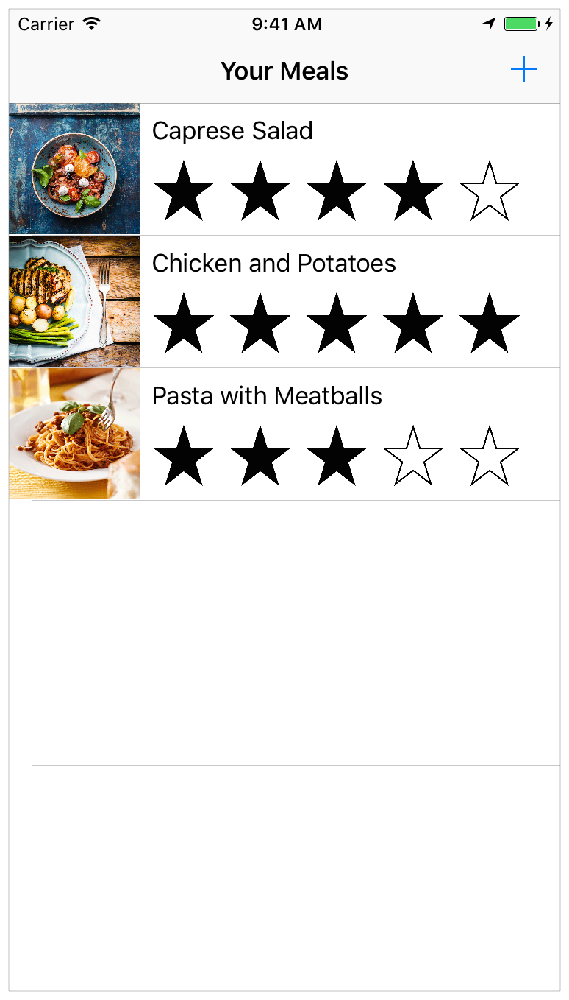
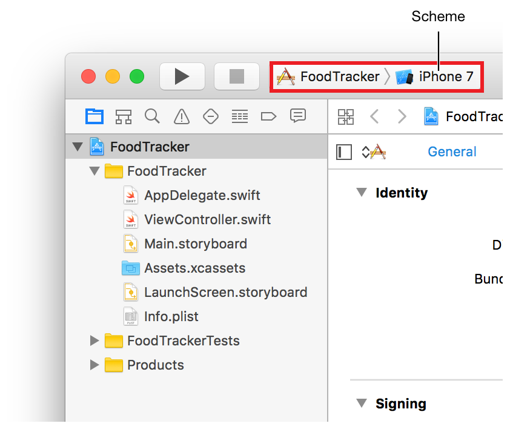
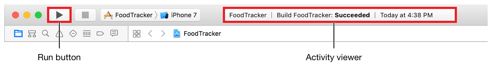
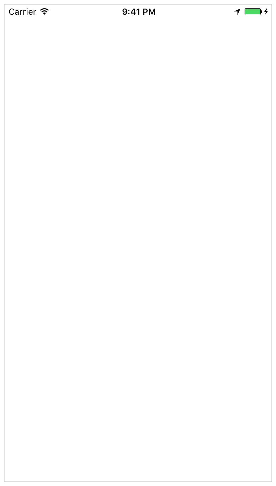

# Start-Developing-iOS-Apps-Swift
Start Developing iOS Apps (Swift)
https://developer.apple.com/library/archive/referencelibrary/GettingStarted/DevelopiOSAppsSwift/#//apple_ref/doc/uid/TP40015214-CH2-SW1

# Getting started
## Jump Right In
### About the Lessons

FoodTracker라는 간단한 식사 추적 응용 프로그램을 만들 것입니다.

### Get the Tools
Mac에서 App Store를 열고 Xcode 최신버전을 설치합니다.

Let’s get started!

## Build a Basic UI
FoodTracker app을 위한 간단한 User Interface(UI)를 만들 것입니다.

### Create a New Project
1. XCode를 실행한다.
2. welcome window에서 "Create a new Xcode project"를 선택하거나 File > New > Project를 선택한다.
3. select Single View Application and then click Next.
4. 앱 이름 및 추가 사항 입력
> * Product Name: FoodTracker
> * Organization Identifier: 보유하고 있는 Organization Identifier를 사용하고 없으면 com.example을 사용한다.
> * Language: Swift
> * Use Core Data: Unselected.
> * Include Unit Tests: Selected.
> * Include UI Tests: Unselected.

### Run iOS Simulator
1. select the iPhone 7 Simulator, not an iOS device.

2. Click the Run button, located in the top-left corner of the Xcode toolbar.

3. 시뮬레이터에서 확인하기.

### Open Your Storyboard
In the project navigator, select Main.storyboard.

### Build the Basic UI
*To add a text field to your scene*
1. Choose Editor > Canvas, and make sure Show Bounds Rectangles is selected.
2. Open the Object library.(Alternatively, choose View > Utilities > Show Object Library.)
3. In the Object library, type text field in the filter field to find the Text Field object quickly.
4. Drag a Text Field object from the Object library to your scene.
5. Drag the text field so that it’s positioned in the top half of the scene and aligned with the left margin in the scene.
6. If necessary, click the text field to reveal the resize handles.
7. Resize the left and right edges of the text field until you see three vertical layout guides: the left margin alignment, the horizontal center alignment, and the right margin alignment.

*To configure the text field’s placeholder text*
1. With the text field selected, open the Attributes inspector image:  in the utility area.
2. In the Attributes inspector, find the field labeled Placeholder and type Enter meal name.
3. Press Return to display the new placeholder text in the text field.

*To configure the text field’s keyboard*
1. Make sure the text field is still selected.
2. In the Attributes inspector, find the field labeled Return Key and select Done (scroll down if necessary).
3. This change will make the default Return key on the keyboard more pronounced to the user by changing it into a Done key.
4. In the Attributes inspector, select the Auto-enable Return Key checkbox (again, scroll down if necessary).
5. This change makes it impossible for the user to tap the Done key before typing text into the text field, ensuring that users can never enter an empty string as a meal name.

*To add a label to your scene*
Double-click the label and type Meal Name.

*To add a button to your scene*
Double-click the button and type Set Default Label Text.

  

